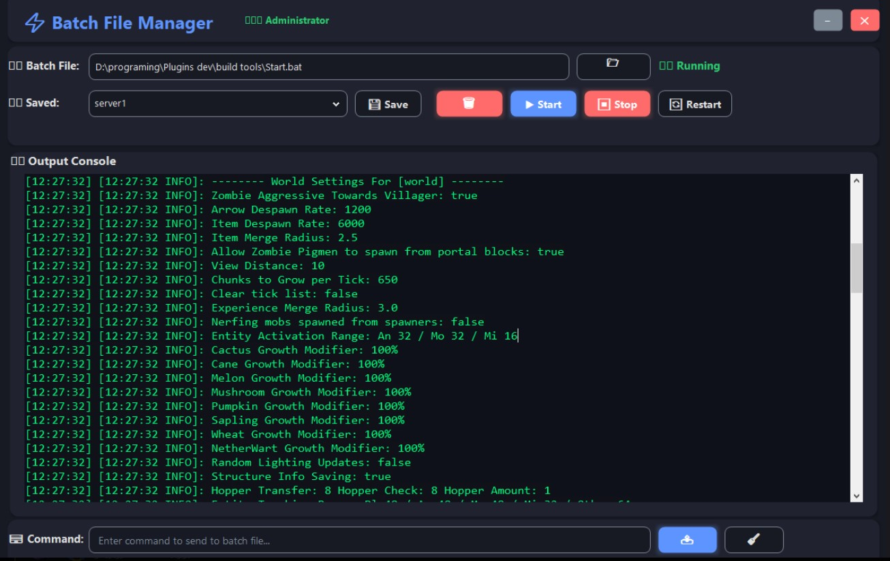

# ⚡ GUI Local Servers Manager

A powerful, dark-themed desktop tool for managing multiple local Minecraft servers with ease.

---

## 🚀 Overview

**GUI Local Servers Manager** is a modern solution for Minecraft plugin developers and testers who need to manage multiple local servers — across different versions — all from one sleek interface.

No more messy folders, multiple windows, or command-line juggling. Whether you're running Spigot, Paper, or custom `.bat` scripts, this tool keeps everything organized, controlled, and accessible.

---

## 🔥 Preview

> *Clean, responsive, and made for developers who want control and clarity.*

---

## 🧩 Key Features

- 🎮 **Multi-Server Management**  
  Handle multiple Minecraft server launchers in one place — no version conflicts or lost batch files.

- 🔧 **Plugin Testing Made Easy**  
  Instantly start/stop/restart any server and send commands live — perfect for plugin debugging.

- 🗃️ **Custom Launcher Profiles**  
  Save your `.bat` files with custom names, manage them through a dropdown list, and launch with one click.

- 📤 **Real-Time Command Input & Output**  
  Type commands directly and see server responses in a beautiful console interface.

- 🛡️ **Administrator-Aware**  
  Automatically elevates itself to admin mode when required to execute `.bat` files properly.

- 🌙 **Dark Themed UI**  
  Crafted with a modern aesthetic using Guna.UI2 — smooth, clean, and distraction-free.

---

## 🎯 Why This Tool?

Plugin developers often need to:
- Test across **multiple Minecraft versions**.
- Run and switch between **several local servers**.
- Use `.bat` files but **hate working in raw CMD**.

**GUI Local Servers Manager** solves all of this by bringing:
- A centralized GUI launcher hub.
- Persistent configuration storage.
- Live command interaction.
- Cleaner workflow.

---

## 🙏 Special Thanks

Big thanks to [@Mqzn](https://github.com/Mqzn)

---

## 💡 Perfect For

- Minecraft plugin developers
- Server modders and testers
- Anyone managing multiple `.bat` Minecraft server launchers

---

**Say goodbye to chaos. Run your servers smarter, faster, and cooler.**
